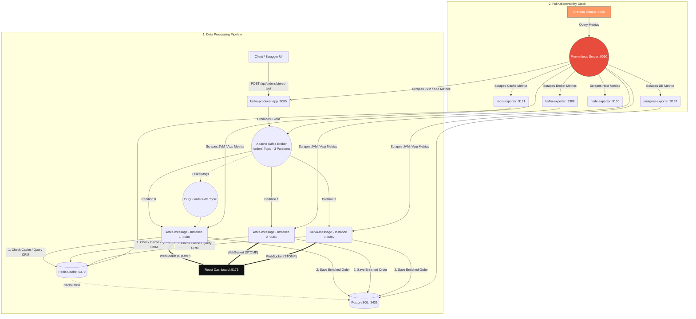
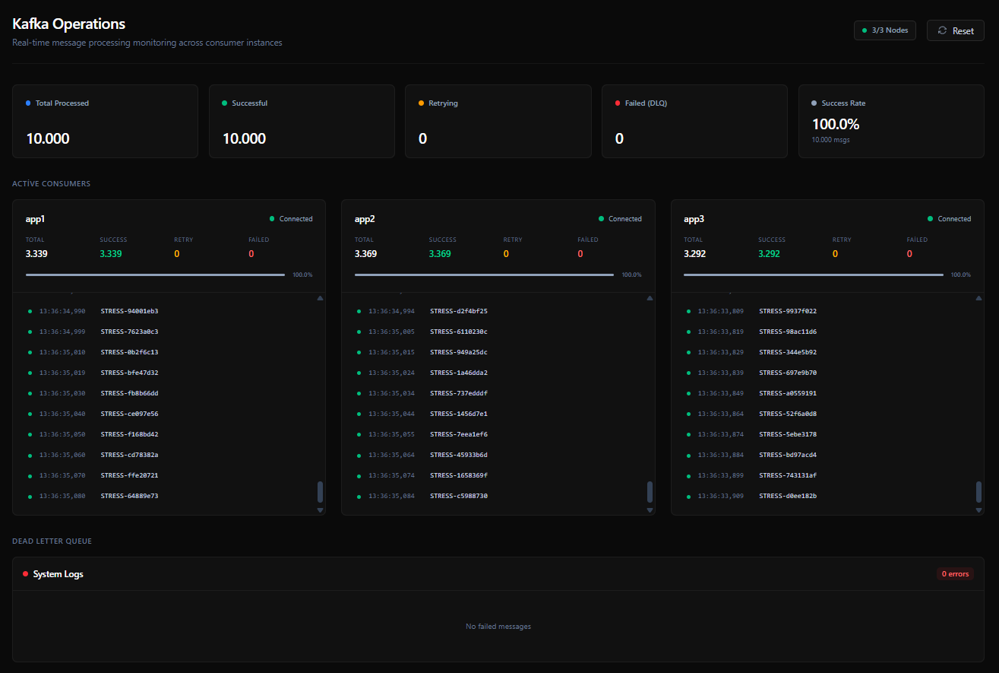

# 🚀 Distributed Kafka Microservices Architecture

[](https://spring.io/projects/spring-boot)
[](https://kafka.apache.org/)
[](https://www.postgresql.org/)
[](https://redis.io/)
[](https://prometheus.io/)
[](https://grafana.com/)
[](https://www.docker.com/)

A modern, production-grade distributed system demonstrating an **Event-Driven Microservices Architecture** using Apache Kafka, Spring Boot, PostgreSQL, and Redis cache, fully monitored with Prometheus & Grafana.

This project highlights key architectural patterns: **Real-Time Stream Enrichment** with memory-speed **Redis Caching**, **Out-of-Order Message Resolution**, and **Full Stack Observability** via custom Actuators, Kafka metrics, and database/cache metrics visualized on a high-performance React dashboard and Grafana.

---

## 📖 Overview

This repository contains a multi-module microservice ecosystem designed for high-throughput messaging. It separates concerns strictly into **Producer** and **Consumer** microservices, mimicking real-world backend infrastructures used by large tech companies.

The architecture ensures **Data Consistency, Parallel Processing, and Fault Tolerance** utilizing a **Dead Letter Queue (DLQ)** for unrecoverable errors, and utilizes **Redis** to cache lookup operations to prevent database bottlenecks.

---

## 🏗️ Architecture



---

## 🛠️ Key Architectural Patterns Implemented

### 1. Real-Time Stream Enrichment (Reference Table Joining)
To keep the network payload light, the Kafka producer publishes minimal transactional order messages (containing only `orderId`, `customerName`, and `amount`).
*   **Static Reference Data:** Upon startup, a `DataInitializer` pre-populates a PostgreSQL table `customer_details` with 1,000 reference records representing a mock CRM system.
*   **The Enrichment Process:** When the consumer microservices retrieve order messages from Kafka, they query the customer details using `customerName` as a **join key**. They merge the transaction details with the reference details to write a complete `EnrichedOrder` entity into the database.

### 2. High-Performance Reference Data Caching (Redis Cache)
In a high-throughput event streaming system, performing a database lookup on every single incoming event can quickly saturate the database connection pool and CPU.
*   **The Cache-Aside Pattern:** We integrated **Redis** as a distributed cache layer using Spring Cache (`@Cacheable`).
*   **How it Works:** 
    *   When an order event arrives, the consumer first checks the Redis cache using the `customerName` as the cache key.
    *   **Cache Hit:** The enriched customer details are retrieved directly from the memory cache in sub-millisecond times, bypassing PostgreSQL entirely.
    *   **Cache Miss:** The database is queried, the record is automatically cached in Redis for subsequent lookups, and the enrichment proceeds.
*   **Result:** Drastically reduces database query load during stress tests from $O(N)$ database lookups to a single initial database lookup per customer, followed by memory-speed lookups for all future messages.

### 3. Distributed Out-of-Order Solution (Logical Sorting Key)
Because 3 consumer microservice instances concurrently process messages from 3 partitions, the order in which messages are written to PostgreSQL is inherently non-deterministic (a race condition based on thread execution speed).
*   **The Problem:** The database Primary Key (`id`) values are assigned based on arrival sequence, making chronological insertion order appear random when viewed.
*   **The Solution:** We extracted the numeric suffix from the customer name (e.g. `"Customer-42"` $\to$ `42`) to create a persistent **Logical Sorting Key** (`customer_index`).
*   **The Resolution:** 
    *   **In Database:** Running `SELECT * FROM enriched_orders ORDER BY customer_index ASC;` groups and displays all customer orders in their natural sequential order regardless of when they physically arrived.
    *   **In React Dashboard:** The consumer sends the `customerIndex` through the WebSocket event payload. The React client dynamically sorts the live stream data on the client side, showing a clean sequence from `Customer-0` to `Customer-99`.

### 4. Enterprise-Grade Monitoring and Metrics (Prometheus & Grafana)
To maintain visibility over the health, latency, and throughput of the distributed components, the infrastructure is fully instrumented with Prometheus metrics and visualized via Grafana.
*   **Spring Boot Actuator & Micrometer:** Both the producer and consumer apps expose standard JVM, application, and custom metrics (such as `order.processing.time` timer metric) formatted for Prometheus via the `/actuator/prometheus` endpoint.
*   **Targeted Exporters:**
  *   **Kafka Exporter:** Exposes consumer group lag, offsets, topic partition statistics.
  *   **Redis Exporter:** Exposes cache hits, cache misses, memory usage, command latency.
  *   **PostgreSQL Exporter:** Exposes database connections, active queries, read/write throughput.
  *   **Node Exporter:** Exposes host-level resources (CPU, Memory, Disk, Network) from the Docker environment.
*   **Prometheus Scraper:** Aggregates metrics every 15 seconds across all these sources.
*   **Grafana Visualization:** A central metrics dashboard that queries Prometheus, allowing operators to monitor system performance under load, analyze bottlenecks, and trace message processing latencies.

---

## ✨ Features

- **Microservices Separation:** Clear boundary between producing events (`kafka-producer-app`) and consuming/processing events (`kafka-message`).
- **Horizontal Scalability:** The consumer is deployed as **3 separate independent containers** processing data concurrently from 3 Kafka partitions, maximizing throughput.
- **Distributed Cache Integration:** Leverages Redis for microsecond CRM customer database lookups.
- **Real-Time Monitoring Dashboard:** A React/TypeScript minimalist dashboard connects via WebSockets (SockJS/STOMP) directly to all consumer instances, rendering live processing metrics, throughput, and DLT logs. optimized with `requestAnimationFrame` for 10K+ messages.
- **Stress Testing Built-in:** The producer application includes a dedicated endpoint to fire 10,000+ messages in milliseconds to test cluster performance.
- **Dead Letter Queue (DLQ) & Retry Mechanism:** Automatic backoff and retries for failed messages. Unrecoverable messages are elegantly routed to the DLQ and persisted in a `failed_messages` table.
- **Integration Testing:** Comprehensive end-to-end testing of the distributed structure using **Testcontainers** (spinning up ephemeral Kafka & PostgreSQL containers).
- **Timezone Synchronization:** Container timezones are strictly mapped to `Europe/Istanbul` to ensure accurate database timestamps.
- **Full Stack Observability:** Out-of-the-box support for Prometheus metrics scraping and Grafana dashboard visualization with node, postgres, redis, and kafka resource exporters.

---

## 📂 Project Structure

- `kafka-producer-app/` - The Producer Microservice (API Gateway). Validates incoming requests and publishes them to Kafka.
- `kafka-message/` - The Consumer Microservice (Worker). Listens to Kafka partitions, queries the Redis CRM cache/database, processes data, and persists it to PostgreSQL.
- `monitoring-dashboard/` - React + TypeScript Frontend application using Tailwind CSS to visualize live Kafka message processing.
- `prometheus.yml` - Configuration specifying scrape targets (Spring apps, Kafka, Redis, PostgreSQL, Host).
- `docker-compose.yml` - Root orchestration file to spin up the entire infrastructure (Kafka, Postgres, Redis, Prometheus, Grafana, all exporters, Producer, 3x Consumers).

---

## 🚀 Getting Started

### Prerequisites
*   [Docker](https://www.docker.com/) and Docker Compose installed.

### Installation & Run

1. Clone the repository:
```bash
git clone <your-repo-url>
cd <project-folder>
```

2. Start the entire infrastructure (12 containers) using Docker Compose:
```bash
docker compose up -d --build
```

---

## 🔗 Access Points

Once the containers are running, you can access the following services:

| Service | URL | Description | Credentials |
|---------|-----|-------------|-------------|
| **React Dashboard** | [http://localhost:5173](http://localhost:5173) | Live message processing, active connections, and DLT logs | *None* |
| **Producer Swagger UI** | [http://localhost:8085/swagger-ui.html](http://localhost:8085/swagger-ui.html) | **(Start Here)** Send Stress Test REST requests to the cluster | *None* |
| **Grafana** | [http://localhost:3000](http://localhost:3000) | Live performance charts, JVM stats, DB & Redis metrics | `admin` / `admin` |
| **Prometheus** | [http://localhost:9090](http://localhost:9090) | Query metric expressions, check scrape targets health | *None* |
| **Kafka UI** | [http://localhost:8090](http://localhost:8090) | Monitor Kafka topics, partitions, messages, and consumer groups | *None* |
| **PostgreSQL** | `localhost:5433` | DB Access (Database: `postgres`, User: `postgres`) | password: `1` |
| **Redis** | `localhost:6379` | Memory cache access | *None* |
| **Redis Exporter** | [http://localhost:9121/metrics](http://localhost:9121/metrics) | Scraped metrics for Redis Cache | *None* |
| **Postgres Exporter** | [http://localhost:9187/metrics](http://localhost:9187/metrics) | Scraped metrics for Postgres Database | *None* |
| **Kafka Exporter** | [http://localhost:9308/metrics](http://localhost:9308/metrics) | Scraped metrics for Kafka Cluster | *None* |
| **Node Exporter** | [http://localhost:9100/metrics](http://localhost:9100/metrics) | Scraped metrics for host CPU/Memory | *None* |

> **Note:** To prevent conflicts with local PostgreSQL installations, the Docker PostgreSQL port is mapped to `5433`.

---

## 🔥 How to perform a Stress Test and Monitor Performance

1.  Open the **Producer Swagger UI**: `http://localhost:8085/swagger-ui.html`
2.  Navigate to `POST /api/orders/stress-test`
3.  Click **Try it out**, enter a count (e.g., `10000`) and hit **Execute**.
4.  Open the **React Monitoring Dashboard** (`http://localhost:5173`) and watch the 3 Consumer instances process the massive load in parallel!
5.  Open **Grafana** (`http://localhost:3000`) to view live performance graphs:
    *   Add Prometheus (`http://prometheus:9090`) as a Data Source.
    *   Monitor JVM statistics, active database connections via Postgres Exporter, and cache hit ratios via Redis Exporter.
6.  Open **Prometheus Targets** (`http://localhost:9090/targets`) to verify that all 9 exporter/application scrape targets are `UP` and healthy.

---

## 📊 Live Monitoring Dashboard

To visualize the message throughput during a stress test, a specialized React dashboard is provided. It connects directly to the backend instances via WebSockets.



### How to Run the React Dashboard locally (Optional):
```bash
cd monitoring-dashboard
npm install
npm run dev
```

---
*Developed as a project to demonstrate advanced distributed system patterns, high-performance caching, and full-stack observability.*
