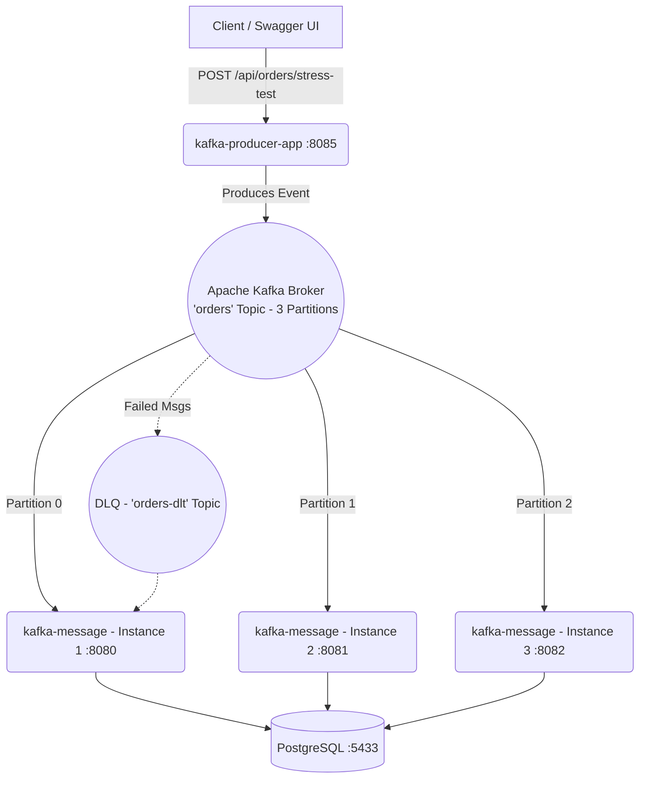

# 🚀 Distributed Kafka Microservices Architecture

[](https://spring.io/projects/spring-boot)
[](https://kafka.apache.org/)
[](https://www.postgresql.org/)
[](https://www.docker.com/)

A modern, production-grade distributed system demonstrating an **Event-Driven Microservices Architecture** using Apache Kafka, Spring Boot, and PostgreSQL.

## 📖 Overview

This repository contains a multi-module microservice ecosystem designed for high-throughput messaging. It separates concerns strictly into **Producer** and **Consumer** microservices, mimicking real-world backend infrastructures used by large tech companies.

The architecture ensures **Data Consistency, Parallel Processing, and Fault Tolerance** utilizing a **Dead Letter Queue (DLQ)** for unrecoverable errors.

## 🏗️ Architecture



## ✨ Key Features

- **Microservices Separation:** Clear boundary between producing events (`kafka-producer-app`) and consuming/processing events (`kafka-message`).
- **Horizontal Scalability:** The consumer is deployed as **3 separate independent containers** processing data concurrently from 3 Kafka partitions, maximizing throughput.
- **Stress Testing Built-in:** The producer application includes a dedicated endpoint to fire 10,000+ messages in milliseconds to test cluster performance.
- **Dead Letter Queue (DLQ) & Retry Mechanism:** Automatic backoff and retries for failed messages. Unrecoverable messages are elegantly routed to the DLQ and persisted in a `failed_messages` table.
- **Integration Testing:** Comprehensive end-to-end testing of the distributed structure using **Testcontainers** (spinning up ephemeral Kafka & PostgreSQL containers).
- **Timezone Synchronization:** Container timezones are strictly mapped to `Europe/Istanbul` to ensure accurate database timestamps.

## 📂 Project Structure

- `kafka-producer-app/` - The Producer Microservice (API Gateway). Validates incoming requests and publishes them to Kafka.
- `kafka-message/` - The Consumer Microservice (Worker). Listens to Kafka partitions, processes data, and persists it to PostgreSQL.
- `docker-compose.yml` - Root orchestration file to spin up the entire infrastructure (Kafka, Postgres, UI, Producer, 3x Consumers).

## 🚀 Getting Started

### Prerequisites
- [Docker](https://www.docker.com/) and Docker Compose installed.

### Installation & Run

1. Clone the repository:
```bash
git clone <your-repo-url>
cd <project-folder>
```

2. Start the entire infrastructure (7 containers) using Docker Compose:
```bash
docker compose up -d --build
```

### 🔗 Access Points

Once the containers are running, you can access the following services:

| Service | URL | Description |
|---------|-----|-------------|
| **Producer Swagger UI** | [http://localhost:8085/swagger-ui.html](http://localhost:8085/swagger-ui.html) | **(Start Here)** Send Stress Test REST requests to the cluster |
| **Kafka UI** | [http://localhost:8090](http://localhost:8090) | Monitor Kafka topics, partitions, and consumers |
| **PostgreSQL** | `localhost:5433` | DB Access (User: `postgres`, Pass: `1`) |

> **Note:** To prevent conflicts with local PostgreSQL installations, the Docker PostgreSQL port is mapped to `5433`.

## 🔥 How to perform a Stress Test

1. Open the **Producer Swagger UI**: `http://localhost:8085/swagger-ui.html`
2. Navigate to `POST /api/orders/stress-test`
3. Enter a count (e.g., `5000`) and hit Execute.
4. Open your DB client (DBeaver) or Docker Logs to watch the 3 Consumer instances process the massive load in parallel!

---
*Developed as an internship project to demonstrate advanced distributed system patterns.*
