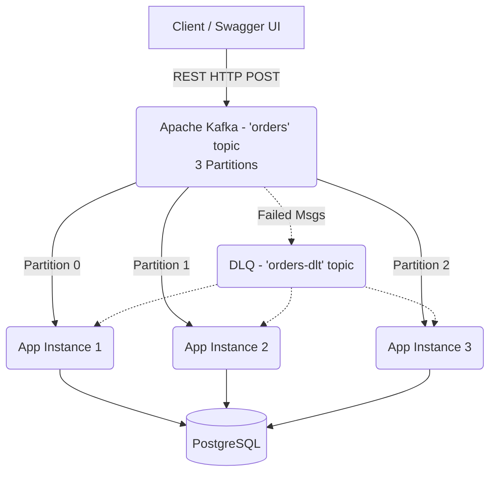

# 🚀 Distributed Kafka Messaging System

[](https://spring.io/projects/spring-boot)
[](https://kafka.apache.org/)
[](https://www.postgresql.org/)
[](https://www.docker.com/)

A modern, horizontally scalable, event-driven Spring Boot microservice application demonstrating distributed messaging with Apache Kafka and PostgreSQL.

## 📖 Overview

This project simulates a real-world backend architecture where high-throughput messaging is required. The system leverages **Apache Kafka** to distribute the workload across multiple independent application instances (consumers) operating within the same consumer group.

The architecture ensures **Data Consistency, Parallel Processing, and Fault Tolerance** utilizing a Dead Letter Queue (DLQ) for error handling.

## 🏗️ Architecture



## ✨ Key Features

- **Horizontal Scalability:** Deployed as 3 separate independent containers (`app1`, `app2`, `app3`) processing data concurrently from 3 Kafka partitions.
- **Dead Letter Queue (DLQ) & Retry Mechanism:** Automatic backoff and retries for failed messages. Unrecoverable messages are elegantly routed to the DLQ and persisted in a `failed_messages` table.
- **Data Validation:** Strict payload validation (`@Valid`, `@NotBlank`, `@Positive`) before data enters the processing pipeline.
- **Integration Testing:** Comprehensive end-to-end testing of the distributed structure using **Testcontainers** (spinning up ephemeral Kafka & PostgreSQL containers).
- **Timezone Synchronization:** Container timezones are strictly mapped to `Europe/Istanbul` to ensure accurate database timestamps.
- **API Documentation:** Interactive **Swagger UI / OpenAPI** integration for effortless API testing.

## 💻 Tech Stack

- **Framework:** Java 17+, Spring Boot 3
- **Messaging:** Apache Kafka, Spring Kafka
- **Database:** PostgreSQL, Spring Data JPA
- **Testing:** JUnit 5, Testcontainers, Awaitility
- **Containerization:** Docker, Docker Compose
- **Documentation:** Springdoc OpenAPI (Swagger)

## 🚀 Getting Started

### Prerequisites
- [Docker](https://www.docker.com/) and Docker Compose installed.
- (Optional) Java 17 and Maven if you wish to run it locally outside of Docker.

### Installation

1. Clone the repository:
```bash
git clone <your-repo-url>
cd kafka-message
```

2. Start the entire infrastructure using Docker Compose:
```bash
docker compose up -d --build
```
*This command will start 1x Kafka broker, 1x PostgreSQL, 1x Kafka-UI, and 3x Spring Boot app instances.*

### 🔗 Access Points

Once the containers are running, you can access the following services:

| Service | URL | Description |
|---------|-----|-------------|
| **Swagger UI** | [http://localhost:8080/swagger-ui.html](http://localhost:8080/swagger-ui.html) | Send REST requests to the cluster |
| **Kafka UI** | [http://localhost:8090](http://localhost:8090) | Monitor Kafka topics, partitions, and consumers |
| **PostgreSQL** | `localhost:5433` | DB Access (User: `postgres`, Pass: `1`) |

> **Note:** To prevent conflicts with local PostgreSQL installations, the Docker PostgreSQL port is mapped to `5433`.

## 🧪 Testing

To run the integration tests using Testcontainers (requires Docker to be running):

```bash
./mvnw test
```
The integration test suite will verify the distributed architecture by spawning 3 concurrent listener threads and asserting successful processing of bulk messages.

---
*Developed as an internship project to demonstrate advanced distributed system patterns.*
